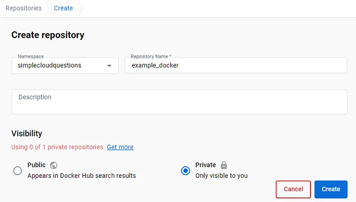
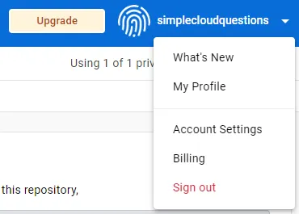
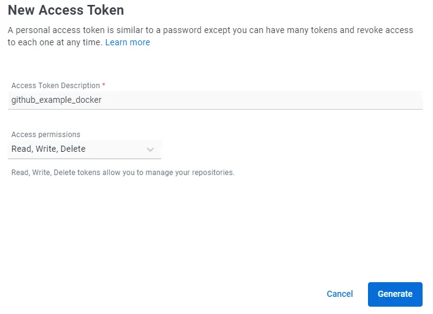
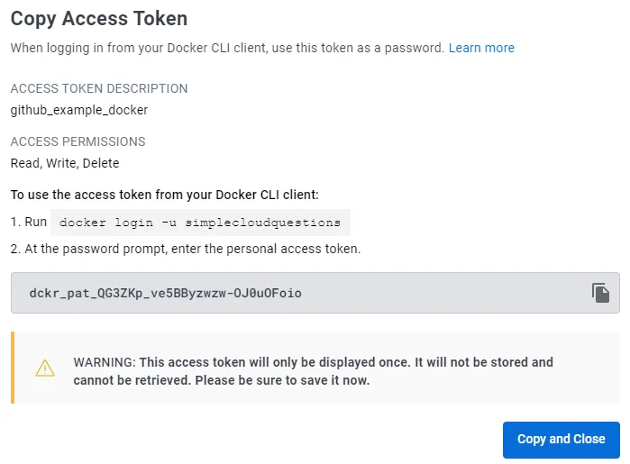
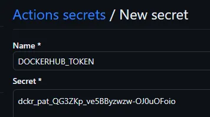
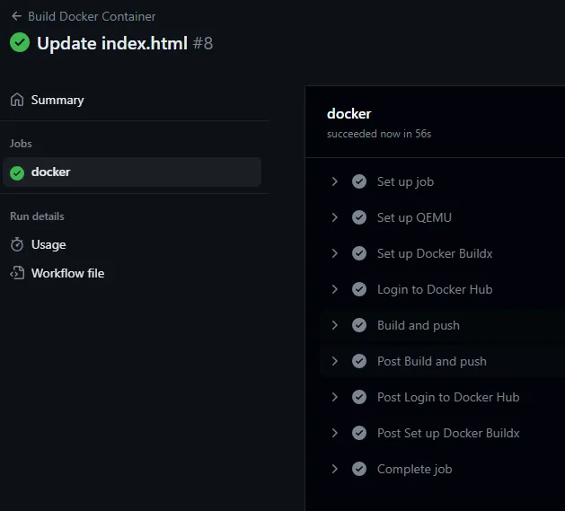
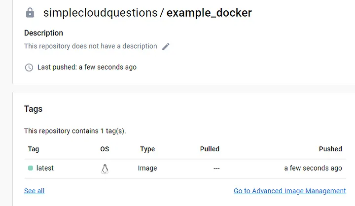

# Exercice 2 -  Construction d'une image docker et stockage de cette image


## Objectifs :

Cet exerice a pour objectifs de :

* Automatiser la construction d'une image docker
* La stocker sur le docker hub

## Mise en place du dépôt dans Docker Hub

* Créer un compte et Connectez-vous dans Docker Hub : https://hub.docker.com/
* Cliquez sur « Créer un dépôt »
  


* Maintenant, nous devons créer un jeton d'accès qui sera utilisé par le flux de travail Github pour pousser notre image docker vers Docker hub.



 * Allez à « Paramètres de compte », « Sécurité », « Nouveau jeton d'accès » et fournir une description du jeton d'accès.



* Vous recevrez un jeton d'accès personnel qui sera utilisé par des actions github
  


* Allez dans votre dépôt Github « Paramètres », « Secrets et variables », « Actions » et créez « Nouveau secret de dépôt ».
* Nommez-le DOCKERHUB_TOKENet la valeur de pâte à partir de l'étape précédente




* Créer un autre secret de dépôt nommé DOCKERHUB_USERNAMEet insérez votre nom d'utilisateur Docker Hub.


## Ajouter le build et le push a votre workflow github action

* Modifier le fichier yaml de votre workflow et ajouter à la suite des étapes précédentes les étapes ci-dessous :

```
-
        name: Set up QEMU
        uses: docker/setup-qemu-action@v2
      -
        name: Set up Docker Buildx
        uses: docker/setup-buildx-action@v2
      -
        name: Login to Docker Hub
        uses: docker/login-action@v2
        with:
          username: ${{ secrets.DOCKERHUB_USERNAME }}
          password: ${{ secrets.DOCKERHUB_TOKEN }}
      -
        name: Build and push
        uses: docker/build-push-action@v4
        with:
          push: true
          tags: simplecloudquestions/example_docker:latest
```

* /!\ Remplacer simplecloudquestions/example_docker par votrenomdutilisateurdockerhub/lenomdevotrereposurdockerhub

* Enregistrer votre fichier (commit)

* Cela va déclenche le workflow, vous devriez voir dans l'onglet Actions un déroulé similaire à celui-ci :

  

  * Attendre que le workflow se termine et aller sur le docker hub.
  * Vous devriez avoir votre image qui a été poussé sur le dépôt DockerHub

  

  * Vous savez maintenant construire une image de manière automatique à chaque push sur le dépôt et l'envoyer sur le docker hub.
 
  ## Pour aller plus loin

  * Dans le dépôt github que vous avez forker il y a un fichier build.gradle. Ajouter une étape à votre workflow pour effectuer le build de Gradle, voir la documentation disponible ici : https://github.com/gradle/actions/blob/main/docs/setup-gradle.md 
