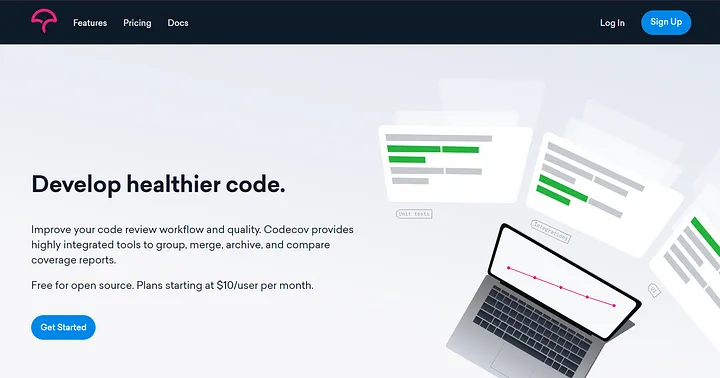
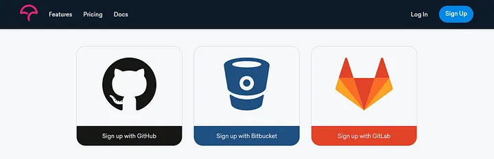
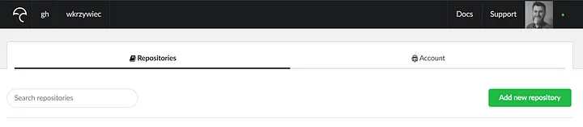
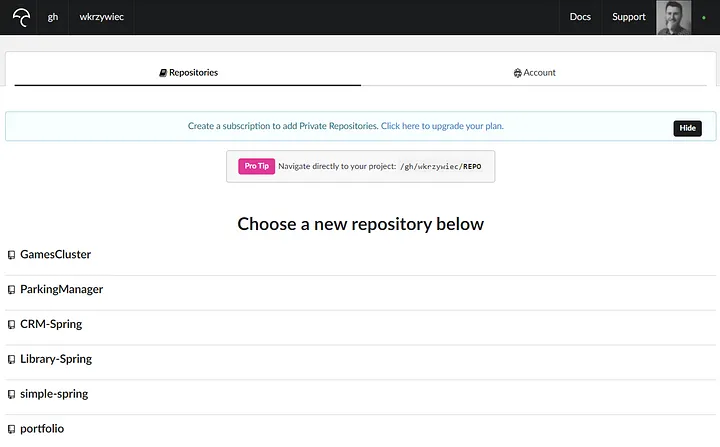
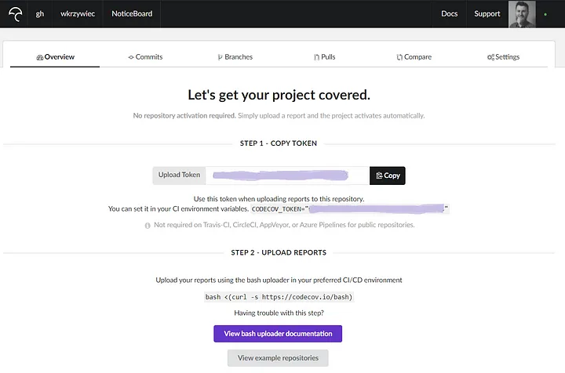
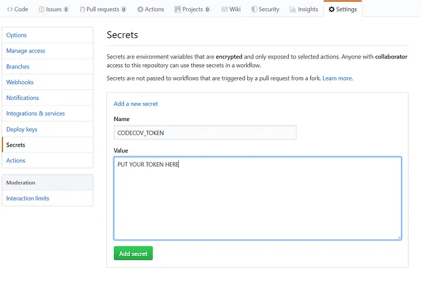
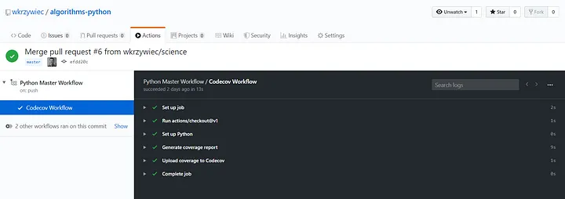
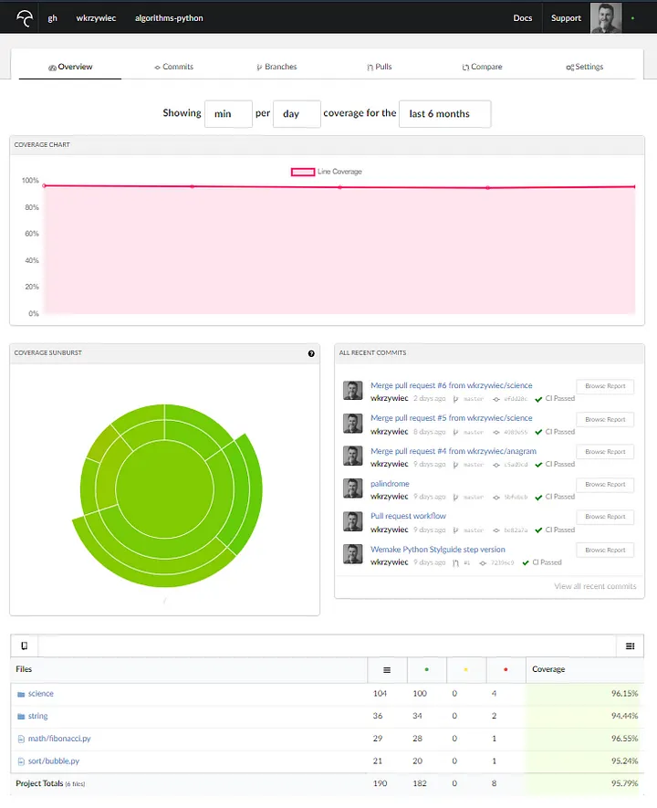

# Exercice 3 - Analyse de code et affichage de rapport


## Objectifs

Cet exercice a pour objectifs :
* D'ajouter des vérifications des normes de codage qui ajoute un commentaire à une PR
* D'afficher un rapport sur la couvertures des tests

## Analyse de qualité de code avec wemake-python-style guidede

* Nous allons mettre en place un flux de travail GitHub Actions qui sera déclenché chaque fois qu'une Pull Request est créée et ajouterons des commentaires à une revue où il trouve des problèmes potentiels.
* Pour commencer, dans le dossier racine de votre projet, créez un dossier .github/workflows
* Puis créer un nouveau fichier avec un nom workflow-pr.yaml.

```
name: Python Pull Request Workflow
on: [pull_request]
jobs:

  qa:
    name: Quality check
    runs-on: ubuntu-latest
    steps:
      - uses: actions/checkout@v1
      - name: Set up Python
        uses: actions/setup-python@master
        with:
          python-version: 3.8
      - name: Wemake Python Stylguide
        uses: wemake-services/wemake-python-styleguide@0.13.4
        continue-on-error: true
        with:
          reporter: 'github-pr-review'
        env:
          GITHUB_TOKEN: ${{ secrets.GITHUB_TOKEN }}
```

* C'est un flux de travail très simple avec l'intégralité namePython Pull Request Workflow. C'est déclenché onchaque pull_request, donc chaque fois que nous créons de nouveaux ou mettons à jour un autre existant suivant jobssera géré.
* Au-dessus du flux de travail, il n'y en a qu'un seul job un travail qui comporte 4 étapes:
  * actions/checkout@v1est nécessaire pour permettre au flux de travail GitHub Actions de savoir qu'il peut utiliser le code situé dans un référentiel,
  * Set up Python qui utilisent actions/setup-python@master pourconfigurer une version Python, dans notre cas, c'est python-version: 3.8.
  *  Wemake Python Styleguide c'est celui qui nous intéresse le plus. Il utilise l'action wemake-services/wemake-python-styleguide@0.13.4 qui est l'éléments de base atomiques des flux de travail. 
Vous pouvez les trouver sur la place du marché GitHub (https://github.com/marketplace?type=actions), comme l'action mentionnée. Celui-ci est configuré ( withclause) à utiliser github-pr-review reporter qui permet les commentaires en ligne dans la révision du code. Enfin, ce flux de travail nécessite de passer votre GIHUB_TOKEN et c'est pourquoi la clause env est ajoutée.
 
## Rapport de couverture de test

* Ensuite, nous voulons avoir un rapport de test avec une couverture. Pour cela, nous utilisons à nouveau la bibliothèque unittest qui va la générer pour nous et ensuite nous la téléchargerons sur le Codecov qui se chargera de la visualiser.
* Avant de définir un nouveau flux de travail, vous devez d'abord créer un compte sur Codecov. Par conséquent, allez sur https://codecov.io au bouton d'inscription situé en haut à droite.



* Choisissez ensuite GitHub comme option d'inscription.



* Ensuite, vous devez être amené à votre tableau de bord pour les projets GitHub, où vous devez cliquer sur le bouton Ajouter un nouveau référentiel.



* Une liste de tous vos projets apparaîtra d'où vous pourrez choisir celui que vous voulez analyser.



* Alors une page avec votre jeton apparaîtra. Sauvez-le, car nous l'utiliserons à l'étape suivante.



* Revenez maintenant au projet sur GitHub et cliquez sur son bouton Paramètres. Il s'agit de Secrets, puis d'un nouveau secret où vous pouvez fournir le jeton que vous avez généré sur le site web de Codecov. Pour le finaliser, cliquez sur Ajouter secret.



* Ok, tout est mis en place, donc nous pouvons passer à la définition du flux de travail GitHub. Ajouter à votre workflow les étapes suivantes :

```
- name: Run unit tests
        run: |
          pip install html-testRunner coverage
          cd app
          python -m unittest test/unit/test.py
          python -m coverage run -m unittest test/unit/test.py
          python -m coverage xml
      - name: Upload coverage to Codecov
        uses: codecov/codecov-action@v1
        with:
          token: ${{ secrets.CODECOV_TOKEN }}
          file: ./coverage.xml
          flags: unittests
```
* Pour le tester, vous devez pousser certains commet à la masterbranche. Cela peut se faire directement à partir de votre dépôt local ou en fusionnant une demande d'extraction. Si tout allait bien, il devrait aimer ceci:



* Maintenant, si vous retournez au codecov jusqu'au tableau de bord de votre projet, vous devriez voir une sortie similaire :


